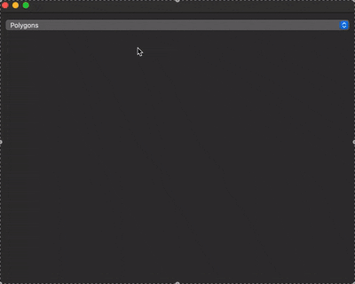

# Raycaster — 2D динамическое освещение и тени (Qt / C++)

Интерактивное Qt-приложение на C++, реализующее **2D ray casting** для построения
областей освещения и теней в реальном времени.

Пользователь может рисовать произвольные многоугольные препятствия, после чего
перемещать источник света и наблюдать динамическую отрисовку теней.

  

---
